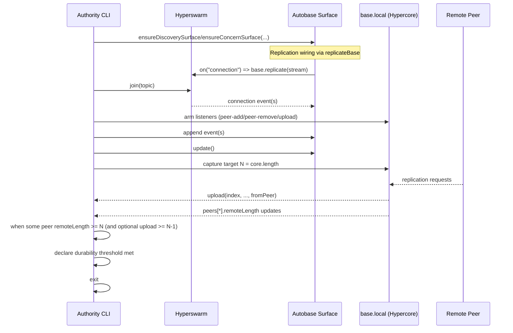

# Stateless CLI Replication Investigation

Date: 2026-02-24
Scope: technical reconnaissance only (no protocol/runtime changes)
Status: legacy investigation note. Low-level peer/core inspection discussed here is operator-side evidence gathering only, not canonical actor posture or app integration guidance.

## 1. Replication Topology Map

### 1.1 Wiring path

- Replication hookup is centralized in `replicateBase(base, swarm)`: it subscribes to `swarm.on("connection")`, calls `base.replicate(conn?.socket ?? conn)` for each new connection, and also replicates immediately over already-open `swarm.connections`. (`src/replicateBase.js:5-29`)
- Discovery surface optionally calls this helper when `swarm` is provided. (`src/discovery.js:69-83`)
- Concern surface always calls this helper (expects a swarm object). (`src/concern.js:44-56`)
- Discovery topic join is done outside `replicateBase`; agent flow joins via `swarm.join(discoveryKey)`. (`src/agent/discovery-roam.js:7-16`, `src/agent/runner.js:115-118`)

### 1.2 Feed ownership and objects

- Autobase exposes:
- `base.local` (local writer core) and `base.view` (opened view object). (`node_modules/autobase/index.js:205-208`, `node_modules/autobase/index.js:353`)
- Discovery `open(store)` returns a core (`store.get({ name: "view" ... })`), so `discoveryBase.view` is a Hypercore-like view core. (`src/discovery.js:86-88`)
- Concern `open(store)` wraps a view core in Hyperbee; underlying core is `concernBase.view.core`. (`src/concern.js:59-63`)
- Concern/getter helpers operate on concern Hyperbee subtrees (`job/*`, `pub/*`, `rat/*`). (`src/concern/views.js:11-24`)

### 1.3 Apply/update loops

- Discovery apply loop consumes Autobase updates and projects into the discovery view via `view.append(...)`, and handles writer additions via `host.addWriter(...)`. (`src/discovery.js:90-105`)
- Concern apply loop consumes updates, projects into Hyperbee leaves, and acknowledges optimistic writers via `host.ackWriter(...)` where applicable. (`src/concern/apply.js:53-207`)
- Host/update loops in orchestration are explicit periodic `base.update(...)` passes (derived-view refresh, not append-success proof). (`scripts/ecology-orchestrator.js:451-461`, `scripts/ecology-orchestrator.js:464-465`, `scripts/ecology-orchestrator.js:898-901`)

### 1.4 Peer/event surfaces available in current stack

- Swarm connection events are used directly (`"connection"`) and connection count is read from `swarm.connections.size`. (`src/replicateBase.js:16`, `src/util/waiters/swarm.js:3-27`)
- Hypercore peer events used by existing helpers: `core.on("peer-add")`, `core.on("peer-remove")`, `core.on("append")`. (`src/util/waiters/core.js:23-29`, `src/util/waiters/core.js:33-50`)
- Hypercore exposes `core.peers` publicly. (`node_modules/hypercore/index.js:594-596`)
- Hypercore peer objects track `remoteLength`. (`node_modules/hypercore/lib/replicator.js:558-560`)
- Hypercore emits indexed transfer events with peer handles:
- `download(index, ..., fromPeer, req)` and `upload(index, ..., fromPeer)`. (`node_modules/hypercore/lib/replicator.js:3094-3100`, `node_modules/hypercore/lib/replicator.js:3103-3108`)
- Hypercore emits `peer-add` / `peer-remove` to sessions. (`node_modules/hypercore/lib/replicator.js:3079-3085`)

## 2. Replication Observability Table

| Signal | YES/NO | Evidence | Notes |
|---|---|---|---|
| Can we detect when a peer connects? | YES | `swarm.on("connection", ...)` in replication wiring and waiters. (`src/replicateBase.js:16`, `src/util/waiters/swarm.js:22-27`) | Swarm-level connection precondition is available today. |
| Can we detect when a peer disconnects? | YES | Core-level `peer-remove` is consumed in waiters. (`src/util/waiters/core.js:23-27`) and emitted by Hypercore replicator. (`node_modules/hypercore/lib/replicator.js:3079-3085`) | Reliable at core/session level; swarm-level disconnect event is not wrapped here. |
| Can we inspect remote feed length? | YES | `core.peers` exists (`node_modules/hypercore/index.js:594-596`) and peer objects include `remoteLength`. (`node_modules/hypercore/lib/replicator.js:558-560`) | No repo helper currently exposes a normalized peer snapshot. |
| Can we inspect local feed length? | YES | `core.length` getter. (`node_modules/hypercore/index.js:549-552`) and repo already reads core lengths. (`src/util/waiters/core.js:40`, `src/util/waiters/view.js:8-13`) | For Autobase writer length, use `base.local.length`. |
| Can we detect when a specific sequence index is downloaded by a peer? | YES | Hypercore emits indexed `download(...)` and `upload(...)` with peer handle (`from`). (`node_modules/hypercore/lib/replicator.js:3094-3100`, `node_modules/hypercore/lib/replicator.js:3103-3108`) | Repo does not currently provide a helper for this; must attach listeners directly to a core. |
| Can we detect when replication is idle? | NO (clean/publicly) | Existing repo docs explicitly call these phase signals, not settled/ready guarantees. (`docs/util/waiters.md:4-5`, `docs/util/waiters.md:19-21`, `docs/util/waiters.md:30-32`) | Internal replicator has `idle()` (`node_modules/hypercore/lib/replicator.js:2997-2999`) but this is not exposed by current repo interfaces. |
| Does `replicateBase` expose peer objects? | NO | `replicateBase` only wires `connection` -> `base.replicate(...)`, iterates existing connections, and returns nothing. (`src/replicateBase.js:5-30`) | No callback, no handle, no peer-level state. |

## 3. Minimal Durability Detection Strategy (Current Code Only)

Goal: detect "at least one peer has replicated all entries up to local length N" without new transport layers.

### 3.1 Event sequence

### 3.2 Objects involved

- `Autobase` surface returned by `ensureDiscoverySurface` / `ensureConcernSurface`. (`src/discovery.js:69-84`, `src/concern.js:44-56`)
- Local writer core: `base.local`. (`node_modules/autobase/index.js:353`)
- Peer list + peer state: `base.local.peers[*]` with `remoteLength`. (`node_modules/hypercore/index.js:594-596`, `node_modules/hypercore/lib/replicator.js:558-560`)
- Transfer events on local writer core (`upload` and/or `download`). (`node_modules/hypercore/lib/replicator.js:3094-3108`)

### 3.3 What must be tracked

- Target length `N` after append/update (`base.local.length` or append return semantics). (`node_modules/hypercore/index.js:549-552`, `node_modules/autobase/index.js:1007-1011`, `node_modules/autobase/index.js:1058`)
- Current peers and peer identity (from `peer-add`/`peer-remove` + `core.peers`). (`src/util/waiters/core.js:23-29`, `node_modules/hypercore/index.js:594-596`)
- Per-peer observed progress:
- `peer.remoteLength`
- optional max uploaded index from `upload(index, ..., fromPeer)`

### 3.4 Cleanest completion condition

- Minimal practical condition: at least one connected peer where `peer.remoteLength >= N`.
- Stronger condition (still best-effort): `peer.remoteLength >= N` and an observed `upload` for index `N-1` for that peer during this CLI session.

### 3.5 Limitations / races

- Listener timing race: if listeners are armed after append, transfer events can be missed.
- `remoteLength` and transfer events are runtime signals, not a persisted durability certificate.
- A peer can disconnect immediately after catching up; long-term durability is not implied.
- `replicateBase` gives no direct peer callback channel; tracking must be attached to the core(s), not to `replicateBase`. (`src/replicateBase.js:5-30`)

## 4. Constraints & Gaps

### 4.1 Missing or weak signals

- No repo-level helper currently exposes peer-level replication progress (`remoteLength`, upload/download by peer) for a surface.
- No repo-level "replication settled/idle" gate; existing waiters are intentionally phase signals only. (`docs/util/waiters.md:4-5`, `docs/util/waiters.md:19-21`, `docs/util/waiters.md:30-32`)

### 4.2 Would we need to modify `replicateBase`?

- Not strictly required for feasibility.
- But ergonomics would improve with a minimal extension that returns lifecycle hooks/state (currently none). (`src/replicateBase.js:5-30`)

### 4.3 Would we need to expose peer-level state?

- For a clean CLI UX: yes, likely as a helper (not protocol/runtime semantic change), because current code leaves this to low-level core inspection.

### 4.4 Inherent Autobase limitations

- `append` success is not durability proof; it is local append intent.
- Acceptance semantics are view materialization via apply/update, not append success. (`scripts/ecology-orchestrator.js:464-465`)
- Autobase update notifications are local convergence signals, not remote durability guarantees. (`node_modules/autobase/index.js:891-901`, `node_modules/autobase/index.js:2030-2031`)

## 5. Risk Assessment

Stateless CLI durability detection is feasible but only as an operational, best-effort threshold.

Main false-assumption modes:

- Peer connected but not actually caught up to target writer feed yet.
- Event timing races (listeners armed too late).
- Transfer event observed but remote node fails shortly after.
- No peers online: threshold cannot be met.

Operational implication:

- For meaningful durability beyond immediate handoff, at least one reasonably stable/always-on replica is needed.

## 6. Minimal Interface Extensions (Proposed, Not Implemented)

If desired, minimal non-semantic interface additions could reduce CLI complexity:

- `replicateBase(base, swarm, { onConnection, onDisconnection })` (or return a controller with connection snapshots).
- `waitForReplicationToLength(core, { targetLength, minPeers, timeoutMs })` helper built on existing core events + peer inspection.
- `getPeerProgress(core)` helper returning stable snapshots (`peerId`, `remoteLength`, connection status).

These are interface ergonomics only; no protocol/apply/discovery semantics change required.

## Feasibility Conclusion

YES: a replication-aware stateless CLI durability threshold is feasible with the current stack, using existing swarm/core signals and peer-length inspection. It is best-effort operational durability, not a hard persistence guarantee.
